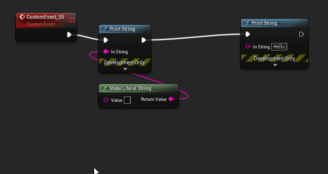
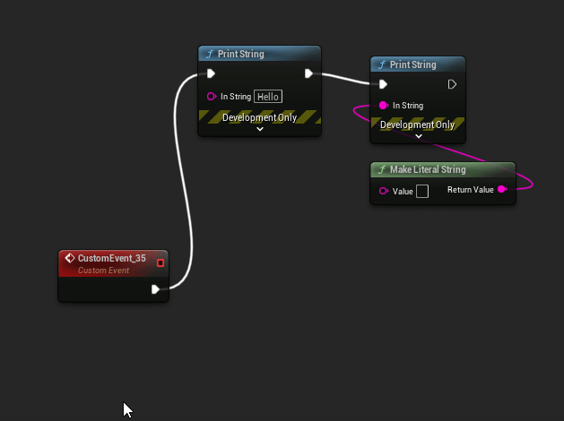

# Command List

| Feature                                                         |                Hotkey                 |
|:----------------------------------------------------------------|:-------------------------------------:|
| [Blueprint Assist hotkey menu](#blueprint-assist-hotkey-menu)   |          `CTRL + SHIFT + F1`          |
| [Open window menu](#open-window-menu)                           |          `CTRL + SHIFT + K`           |
| [Select pin](#select-pin)                                       |              `ArrowKeys`              |
| [Select node](#select-node)                                     |          `CTRL + ArrowKeys`           |
| [Shift camera](#shift-camera)                                   |          `SHIFT + ArrowKeys`          |
| [Open blueprint creation menu](#open-blueprint-creation-menu)   |                 `Tab`                 |
| [Format node](#format-node)                                     |                  `F`                  |
| [Format node selectively](#format-node-selectively)             |              `Shift + F`              |
| [Format all events](#format-all-events)                         |              `CTRL + R`               |
| [Delete and link](#delete-and-link)                             |           `SHIFT + Delete`            |
| [Cut and link](#cut-and-link)                                   |          `CTRL + SHIFT + X`           |
| [Connect unlinked pins](#connect-unlinked-pins)                 |                  `Q`                  |
| [Link nodes between wires](#link-nodes-between-wires)           |              `CTRL + Q`               |
| [Link to hovered pin](#link-to-hovered-pin)                     |          `CTRL + SHIFT + Q`           |
| [Disconnect selected pin](#disconnect-selected-wire-or-pin)     |                  `D`                  |
| [Disconnect node execution](#disconnect-node-execution)         |               `ALT + D`               |
| [Disconnect all pins](#disconnect-all-pins)                     |          `CTRL + SHIFT + D`           |
| [Toggle context sensitive](#toggle-context-sensitive)           |              `CTRL + T`               |
| [Swap node left/right](#swap-node-left/right)                   |      `CTRL + SHIFT + Left/Right`      |
| [Edit selected pin value](#edit-selected-pin-value)             |              `CTRL + E`               |
| [Switch workflow mode](#switch-workflow-mode)                   |               `ALT + O`               |
| [Edit details menu](#edit-details-menu)                         |          `CTRL + SHIFT + E`           |
| [Zoom to node tree](#zoom-to-node-tree)                         |              `CTRL + =`               |
| [Add Symbol menu](#add-symbol-menu)                             |          `CTRL + SHIFT + A`           |
| [Focus search box menu](#focus-search-box-menu)                 |           `CTRL + ALT + F`            |
| [Go to symbol menu](#go-to-symbol-menu)                         |              `CTRL + G`               |
| [Select variable menu](#select-variable-menu)                   |          `CTRL + SHIFT + G`           |
| [Open context menu for pin](#open-context-menu-for-pin)         |              `CTRL+  M`               |
| [Open context menu for node](#open-context-menu-for-node)       |          `CTRL + SHIFT + M`           |
| [Duplicate variable node](#duplicate-variable-node)             |          `CTRL + SHIFT + V`           |
| [Merge selected nodes](#merge-selected-nodes)                   |          `CTRL + SHIFT + V`           |
| [Replace node](#replace-node)                                   |              `CTRL + H`               |
| [Toggle nodes](#toggle-nodes)                                   |              `CTRL + /`               |
| [Split pin](#split-recombine-pin)                               |               `ALT + Q`               |
| [Recombine pin](#split-recombine-pin)                           |           `ALT + CTRL + Q`            |
| [Rename selected node](#rename-selected-node)                   |                 `F2`                  |
| Toggle fullscreen                                               |             `ALT + Enter`             |
| [Group nodes](#group-nodes)                                     |       `ALT + G, ALT + CTRL + G`       |
| [Toggle lock nodes](#toggle-lock-nodes)                         |               `ALT + L`               |
| [Toggle node purity](#toggle-node-purity)                       |           `ALT + SHIFT + G`           |
| [Toggle node advanced display](#toggle-node-advanced-display)   |           `ALT + CTRL + A`            |
| [Expand selection in direction](#expand-selection-in-direction) | `SHIFT + Z (left), SHIFT + X (right)` |

---

## Blueprint Assist hotkey menu

* Open a menu which displays the hotkeys for the plugin

***

## Open window menu
* Search and open a menu or setting with `CTRL + SHIFT + K`

***

## Select pin
* Use the `ArrowKeys` to move the selected pin

* Selecting a node will select the top-right execution pin

* You can also select a pin by left-clicking on it

***
## Select node
* Select a node using `CTRL + ArrowKeys`

***
## Open blueprint creation menu
* Press `Tab` to open the blueprint creation menu. With a pin selected it will create the menu for the pin

***
## Format node
* With a node selected press `F` to format the block of nodes
* If the block of nodes has an event node, it will use it as the root node
* Two styles for parameters: 
    * `Helixing`: Parameter nodes are placed below 
    * `LHS (Left-hand side)`: Parameter nodes are placed on the LHS of the node
* There are commands to forcing a formatting style (unbound by default)
    * Format with Helixing
    * Format with LHS (left-hand side)
* Important settings:
    * `Treat delegates as execution pins (default: true)`: When disabled, this will ignore linked delegate pins (which are directly connected to custom events). You may want to disable this if you prefer your custom events to be manually positioned.
    * `Apply comment padding (default: true)`: Uses comment box bounds when formatting. Use this along with the AutoSizeComment plugin, otherwise disable this.

***
## Format node selectively
* With multiple nodes selected press `Shift + F` to format *only* the selected nodes
* If you have a single node selected, this command will selectively format the node tree to the right

***
## Format all events
* Press `CTRL + R` to format all event nodes on the graph
* See setting `Format All Style` to choose the method of layout:
    * `Simple`: Event nodes are sorted by height and placed in a single column
    * `Smart`: Dynamic columns are created by estimating the width of all linked nodes in the event and then sorted by height
    * `Node Type`: Columns are created based on the node type `{ SpecialRootNodes, ActorEvents, CustomEvents, InputEvents, ComponentEvents, OtherEvents }`
* Blocks can be reordered by moving the height of the event node above other blocks.

***
## Delete and link
* With node(s) selected press `SHIFT + DEL` to delete the nodes while preserving the links

## Cut and link
* Functionally the same as `Delete and Link` above but also copy the selected nodes to your clipboard 

***
## Connect unlinked pins
* With a node selected, press `Q` to connect unlinked pins to nearby nodes

***
## Link nodes between wires
* With a node selected, hover a wire or pin and press `CTRL + Q` to link the node

***
## Link to hovered pin
* Select a pin, then hover another pin and press `CTRL + SHIFT + Q` to link the two pins

***
## Disconnect selected wire or pin
* Hover a wire or pin and press `D` to disconnect

***
## Disconnect node execution
* Select a node and press `ALT + D` to disconnect node execution

***
## Disconnect all pins
* Select a node and press `CTRL + SHIFT + D` to disconnect all pins

***
## Toggle context sensitive
* With the blueprint creation menu open, press `CTRL + T` to toggle context sensitive

***
## Swap node left/right
* With a node selected, press `CTRL + SHIFT + (Left / Right)` to swap the node execution left or right
* By default the swap node command will break looping connections which were created after swapping. See setting: `Blueprint Assist Advanced > RemoveLoopingCausedBySwapping`

***
## Edit selected pin value
* Press `CTRL + E` to start editing the value of the selected pin
* Pressing the hotkey again will move to the next editable value on the pin (for example when editing the Delta Location Vector)

***

## Switch workflow mode
* Press `ALT + O` to switch workflow mode. This is mainly for AnimBP, WidgetBP and BehaviorTrees
* In the AnimBP, it will open a menu since there are more than 2 modes to be selected from

***
## Edit details menu
* Pressing `CTRL + SHIFT + E` will bring up a menu with a list of variables in the Details panel
* Selecting an item in the menu will bring keyboard focus to that variable (boolean variables will be toggled)

***
## Zoom to node tree
* Pressing `CTRL + Equals` will zoom to fit the node tree (all nodes connected to the current node)

***
## Add Symbol menu
* Pressing `CTRL + SHIFT + A` will open a menu allowing you to add a new *graph*, *function* *macro*, *variable* or *event dispatcher*

***
## Go to symbol menu
* Pressing `CTRL + G` will open a menu allowing you to bring viewport focus to any *function* / *macro* / *graph* / *event*

***
## Focus search box menu
* Pressing `CTRL + ALT + F` will open a menu allowing you to bring keyboard focus to a search box in the current window

***
## Select variable menu
* Pressing `CTRL + SHIFT + G` will open a menu allowing you to focus a variable in the blueprint

***
## Open context menu for pin
* Pressing `CTRL + M` will bring up the pin actions for the selected pin

***
## Open context menu for node
* Pressing `CTRL + SHIFT + M` will bring up the node actions for the selected node

***

## Duplicate variable node
* Pressing `CTRL + SHIFT + V` will duplicate a variable node for each of it's links

***

## Merge selected nodes

* Pressing `ALT + SHIFT + M` will merge the selected nodes

***

## Replace node
* Replace the selected node with a new node by pressing `CTRL + H`

***

## Shift camera
* Move the camera using `SHIFT + Arrow Keys`
***

## Toggle nodes
* Disabled or enable selected nodes using `CTRL + \`

***

## Split / recombine pin
* Split hovered or selected pin using `ALT + Q`
* Recombine using `ALT + CTRL + Q`  

***

## Rename selected node
* Rename selected *variable* or *macro* by pressing `F2`

## Group nodes
* Group nodes so they are locked and move together `ALT + G`
* Ungroup nodes with `ALT + CTRL + G`
* Holding down any key while dragging the nodes will stop the group movement

!!! note "Settings"
    * `OnlyDrawGroupOutlineWhenSelected` to only draw the outline when a node is selected
    * `DrawNodeGroupFill` to also highlight the nodes inside the group

## Toggle lock nodes
* Lock nodes so they are ignored by the Blueprint Assist formatter `ALT + L`

!!! warning "Experimental"
    * Currently the formatter doesn't work very well with this. Any downstream nodes will also be ignored.
    * When using this I suggest you use `Selective Formatting (Shift+F)`

## Toggle node purity

* Toggle the execution pins on a node if applicable. Handles `Cast` and `Variable Get` nodes `ALT + SHIFT + G`

## Toggle node advanced display

* Toggle any advanced display pins on the node. Most commonly used for the `Print String` node `ALT + CTRL + A`

## Expand selection in direction

* Using the **hovered node** as the root, expand the selection in the direction
* `Shift + Z` for Left, `Shift + X` for Right
 

