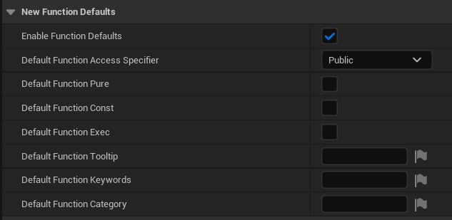
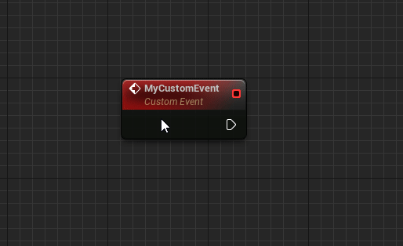
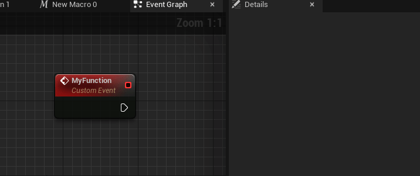

# Editor features

## New Node Behaviour
The plugin supports new auto wiring behaviour when new nodes are placed on the graph. This is determined by 3 settings which can be found in `Editor Preferences > Blueprint Assist Editor Features`.  

* `Connect Execution When Dragging Off Parameter` When creating a new node from a parameter pin, try to connect the
  execution
* `Insert New Execution Nodes` When creating an executable (impure) node from a pin, try to insert the node between
  existing wires
* `Insert New Pure Nodes` When creating a pure (parameter) node from a pin, try to insert the node between existing
  wires

## Generate getter and setter
* New context menu actions for variables to generate getter and setter
* Setting `Merge Generate Getter and Setter Button` to merge into a single action
* Renaming a variable will auto-rename the getter and setter

## Set variable defaults
* Set default properties to be applied to newly created variables

> Here we would like to set all new variables to default to private

## Set function defaults
* Set default properties to be applied to newly created blueprint functions

## Auto add parent node
* Disable this behavior by disabling `Auto Add Parent Node`

## Auto enable Instance Editable
* Enable the variable property `Instance Editable` when you tick Expose on Spawn

## Invisible knot nodes
* Disabled by default, enable with setting `Enable Invisible Knot Nodes`

## Play live compile sound
* Play sound upon successful live compile
* Disabled by default, enable with setting `Play Live Compile Sound`

## Group movement
* While dragging nodes on a graph, hold any `Group Movement Chord` and it will move all linked nodes
* Default key is `Spacebar`, search for `Group Movement Chords` in `Editor Preferences`

## Folder bookmarks
Keybindings to activate a folder in the content browser. While the content browser is open:

* Press `CTRL + SHIFT + {0-9}` to set the bookmark
* Press `CTRL + {0-9}` to activate the bookmark
* See setting `Folder bookmarks` to change keybindings for bookmarks

## Node Groups

Group nodes so they are locked together and moving one node will move the entire group

* Press `ALT + G` to group selected nodes
* Press `ALT + CTRL + G` to ungroup selected nodes nodes
* Holding down `ANY KEY` will allow you to bypass the lock and move nodes individually
* See settings in `Editor Features | Node Group` for different methods of visually displaying the node groups (such as highlighting) 

## Auto Custom Event Replication Flags and Title

When renaming a CustomEvent title it will update the custom event's Replication based on the node title prefix

When changing a CustomEvent Replication it will prefix the custom event's title 

!!! note "Notable Settings"
    * `Clear replication Flags when Renaming with No Prefix` (disabled by default)
        * If you don't add a prefix to the title, the rep flag will be set to `Not Replicated`
    * Settings to change the Prefix for Multicast, Server and Client (default to `Server_` etc)

## Generate Create Event

* Generate a create event node from a delegate pin by right clicking the pin to open the context menu

