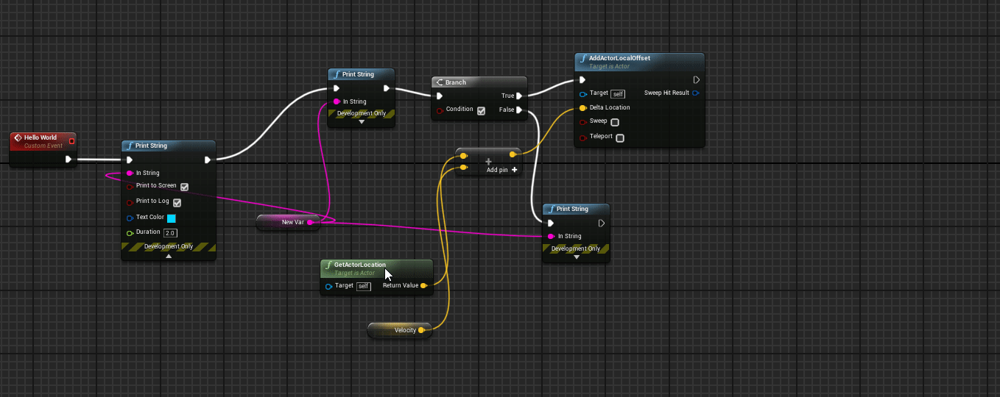

# Home

## Overview

[Marketplace](https://www.unrealengine.com/marketplace/en-US/product/blueprint-assist) | [Forum Post](https://forums.unrealengine.com/t/blueprint-assist-plugin/214123)

The Blueprint Assist plugin adds a large number of quality of life features when working with blueprints

> This page is a quick overview: for a full list of features please look at the [Features](https://github.com/fpwong/BlueprintAssistWiki/wiki/Features) page

***
### Formatting
#### Blueprints

Review This

https://squidfunk.github.io/mkdocs-material/reference/grids/

https://squidfunk.github.io/mkdocs-material/reference/admonitions/

!!! info "This is Blueprints"
    

#### Behavior Tree

> Formatting for other graphs is supported, but is very simple compared to the blueprint editor. Works well for simple graphs such as Sound Cues but not well for complex graphs such as the Material Editor.

***
### Navigating the graph

#### Pin selection and editing

#### Go-to-symbol menu

***
### Miscellaneous helpful commands

#### Link nodes between wires

#### Duplicate node for each link

#### Delete and keep links
